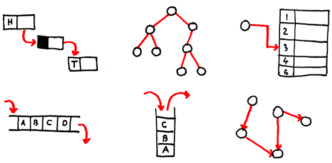

# Algorithms & Data Structure (Java, TypeScript, & Go)

<p align="center"> 
  
</p>
This repository summarize the fundamentals of algorithms & data structures, with short explanations and focusing on key points along with a Java, TypeScript implementations. I'll also add examples in Golang as I continue.

## Topics

[1. Dynamic Connectivity 🐱](dynamic-connectivity/README.md)

## Run examples
Prerequisites: Install typescript and ts-node

```
npm install -g ts-node
npm install -g typescript
```

To run a typescript example
```
ts-node QuickFindAlg.ts
```

To run java samples

```
javac QuickFindAlg.java && java QuickFindAlg
```

### References

Algorithms, 4th Edition
- https://algs4.cs.princeton.edu/home/

Visualising data structures and algorithms through animation
- https://visualgo.net/en