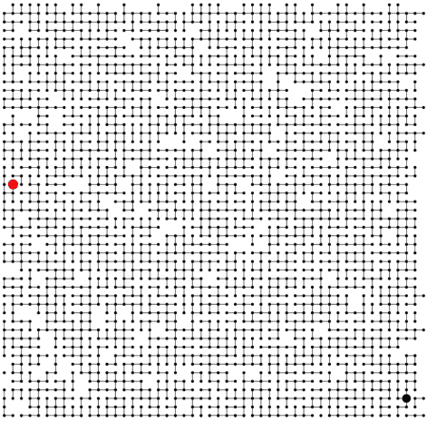
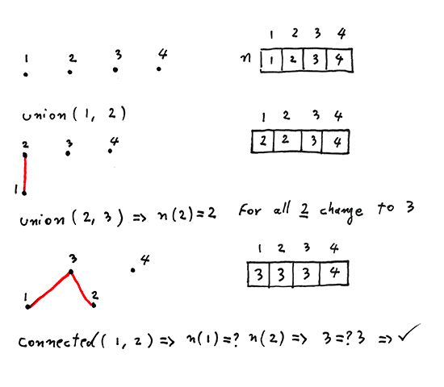
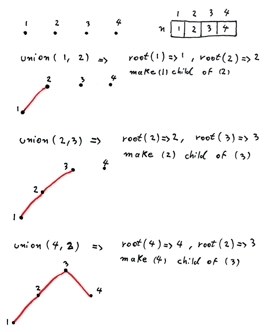
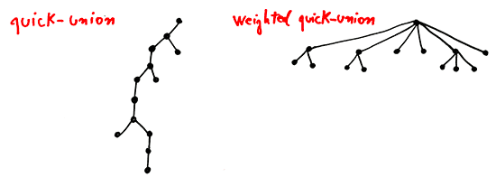

# Dynamic connectivity problem
 
A dynamic connectivity structure is a data structure that dynamically maintains information about the connected components of a graph.



The idea is to first be able to connect two nodes `n` and `m` and then we can check if node `n'` is connected directly or indirectly to node `m'`. In other word to find if there is apth between node `n'` and `m'`

Application fo dynamic connectivity would be:
* Network to find a connection between two node
* Social network to find a relationship between two person
* Pixels in a digital photo
* and more ...

## Quick Find Algorithm



```java
  public boolean connected(int n, int m) {
    return nodes[n] == nodes[m];
  }

  public void union(int n, int m) {
    int nId = nodes[n];
    int mId = nodes[m];
    for (int i = 0; i < nodes.length; i++) {
      if (nodes[i] == nId) {
        nodes[i] = mId;
      }
    }
  }
```

## Quick Union Algorithm



Depth of a node when we have `n` nodes in the worst case scenario is `n`. In this case we have a slim tree.  

```java
  public int root(int n) {
    while (n != nodes[n]) {
      n = nodes[n];
    }
    return n;
  }

  public boolean connected(int n, int m) {
    return root(n) == root(m);
  }

  public void union(int n, int m) {
    int nId = root(n);
    int mId = root(m);
    nodes[nId] = mId;
  }
  ```

## Weighted Quick Union Algorithm

An optimized version Quick-union by checking the size of each tree before connecting them together. The goal is to always add the small tree as a child of large tree. This strategy insures that the final tree is more flat compare to non optimized version of this algorithem.



Depth of any node when we have `n` nodes in the worst case scenario is `lg n (binary log,  log2 n)`. Fro example for 100,000,000 nodes the max depth is ~ 26 which is amazingly good

```java
  public boolean connected(int n, int m) {
    return root(n) == root(m);
  }

  public void union(int n, int m) {
    int nId = root(n);
    int mId = root(m);
    if (weight[nId] > weight[mId]) {
      nodes[mId] = nId;
      weight[nId] += weight[mId];
    } else {
      nodes[nId] = mId;
      weight[mId] += weight[nId];
    }
  }
```

## Weighted Quick Union (with path compression) Algorithm

The idea is to flatten the tree out while we query it. For example after we compute the root of `n` to be `m` then we set `n` to be directly point to the root node of `m`.

Whit adding one line of code this algorithm is now extremely optimized. In practice WQUPC is linear.

```java
  public int root(int n) {
    while (n != nodes[n]) {
      nodes[n] = nodes[nodes[n]];
      n = nodes[n];
    }
    return n;
  }
```

| algorithm  | initialize | union | connected | union (n: 4,294,967,296) |
| ------------- | -------------  | -------------  | ------------- | ------------- |
| quick-find | n | n | 1 |   cost: 4,294,967,296 |
| quick-union | n | n | n | cost: 4,294,967,296 |
| wighted qu| n | log2 n | log2 n | cost: 32 |
| wighted qupc| n | ... | ... | cost: 5 |

