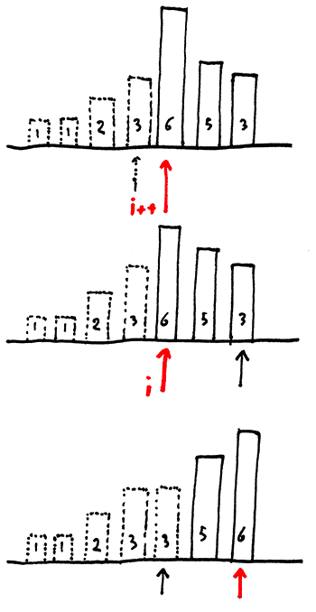

# Elementary Sorts

Qoal: Sort any type of data: 
Q: How can sort() function know how to compare different data types?
A: We use Callback to delegate the job to client to determine whether or not an item `a` is leeds, bigger or equal than item `b`


## Selection Sort



```java
public static void sort(Comparable[] items) {
  int n = items.length;
  for (int i = 0; i < n; i++) {
    int min = i;
    for (int j = i+1; j < n; j++) {
      if (less(items[j], items[min])) {
        min = j;
      }
    }
    exchange(items, i, min)
  }
}
```
Time complexity: (N-1) + (N-2) + ... + 1 + 0 ~ N^2/2
This is a quadratic time complexity which means it is not scalable
