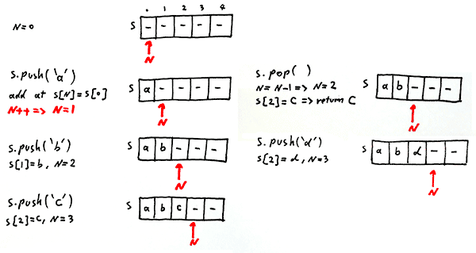

# Queue & Stack


## Stack (linked-list)

Time complexity: constant :)
Space complexity: 16 bytes (object overhead) + 8 bytes (inner class extra overhead) + 8 bytes (refrence to String) + 8 bytes (reference to Node) = 40 bytes per stack node


```java
class LinkedListStack {
  private Node first = null;

  private class Node {
    String item;
    Node next;
  }

  public boolean isEmpty() {
    return first == null;
  }

  public void push(String item) {
    Node newNode = new Node();
    newNode.item = item;
    newNode.next = first;
    first = newNode;
  }

  public String pop() {
    String item = first.item;
    first = first.next;   
    return item;
  }
}
```

## Stack (array)
Array implementation of stack is faster than linked-list however we have to deal with the stack overflows issue when the number of items in the stack exceeds the capacity of the array.# online-courses



```java
class ArrayFixedStack {
  private String[] s;
  private int n = 0;

  public ArrayFixedStack(int capacity) {
    s = new String[capacity];
  }

  public boolean isEmpty() {
    return n == 0;
  }

  public void push(String item) {
    s[n++] = item;
  }

  public String pop() {
    return s[--n];
  }
}
```