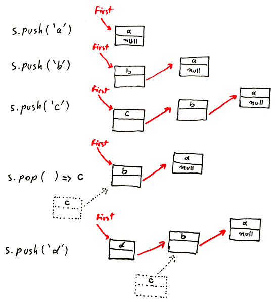
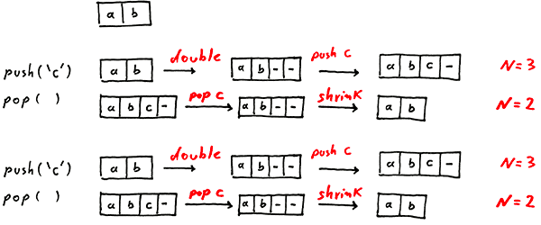
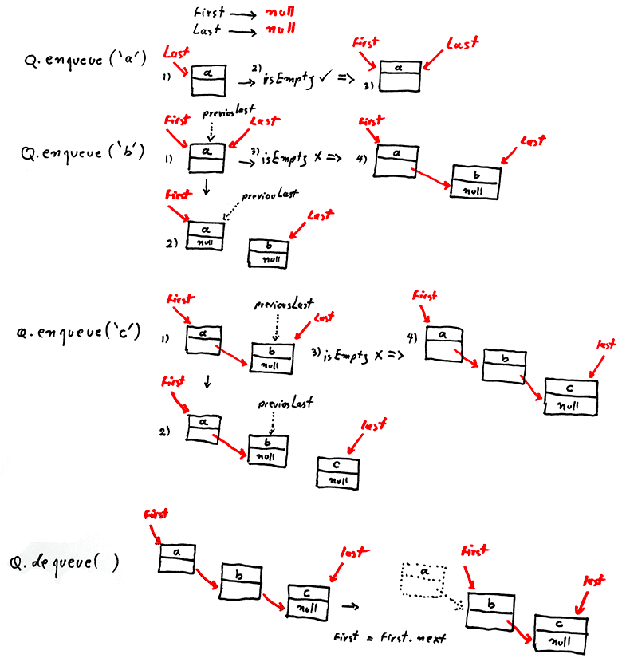

# Queue & Stack


## Stack (linked-list)

Time complexity: constant :)
Space complexity: 16 bytes (object overhead) + 8 bytes (inner class extra overhead) + 8 bytes (refrence to String) + 8 bytes (reference to Node) = 40 bytes per stack node



```java
class LinkedListStack {
  private Node first = null;

  private class Node {
    String item;
    Node next;
  }

  public boolean isEmpty() {
    return first == null;
  }

  public void push(String item) {
    Node newNode = new Node();
    newNode.item = item;
    newNode.next = first;
    first = newNode;
  }

  public String pop() {
    String item = first.item;
    first = first.next;   
    return item;
  }
}
```

## Stack (array)
Array implementation of stack is faster than linked-list however we have to deal with the stack overflows issue when the number of items in the stack exceeds the capacity of the array.# online-courses


```java
class ArrayFixedStack {
  private String[] s;
  private int n = 0;

  public ArrayFixedStack(int capacity) {
    s = new String[capacity];
  }

  public boolean isEmpty() {
    return n == 0;
  }

  public void push(String item) {
    s[n++] = item;
  }

  public String pop() {
    return s[--n];
  }
}
```


## Stack (resizing-array)

A quick solution would be to create one size bigger array when we push and one size smaller when we pop however this is too expensive. For example to insert N items it will takes 1 + 2 + 3 + ... + N = N^2/2 which is infeasible for large N. 

To overcome this issue we try to resize the array infrequently as much as possible. For example one technique is Repeated Doubling when the array is full we create a new array twice the size.

Efficient solution:
* push(): double size of array when it is full
* pop(): halve size of array when it is one-quarter full

```java
  public void push(String item) {
    if (n == s.length) resize(2 * n);
    s[n++] = item;
  }

  private void resize(int capacity) {
    String[] copy = new String[capacity];
    for (int i = 0; i < n; i++) {
      copy[i] = s[i];
    }
    s = copy;
  }
```
Now the cost of inserting first N items is: 
N + (2 + 4 + 8 + ... + N) ~ 3N

N: 1 array access per push
2 + 4 + 8 + ... + N: k array accesses to double to size k



*Why one-quarter?* let say we double the size of array when it is full and halve it when it is one-half full: now consider push-pop-push-pop operations when array if full. Each operation takes time proportional to N and we call it `thrashing issue`. 


## Queue (linked-list)

